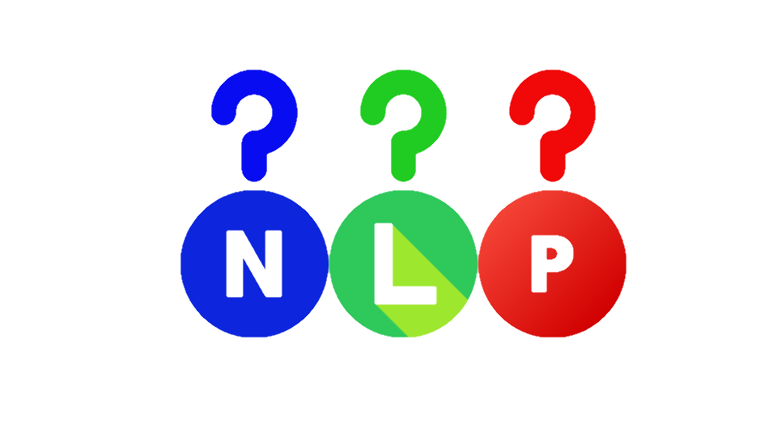

# NLPtest

**NLPtest** is Python package designed to ease *behavioral testing* of Natural Language Processing models to identify
possible capability failures.

## 1. About the project

Behavioral tests are intended to test a model against some input data while treating as a black box. The aim is to
observe the model's reaction against some perturbations that might occur once the model is productionized. For a more
detailed explanation on behavioral testing of NLP models I encourage you to read the insightful
paper: [Beyond Accuracy: Behavioral Testing of NLP models with CheckList](https://arxiv.org/abs/2005.04118)

**NLPtest** provides helper objects for three different aspects:

- easily generate text samples
- test some specific behaviors of your model
- aggregate the tests outcomes of your model

## 2. Getting started

### 2.1. Installation

You can directly install **NLPtest** using [pypi](https://pypi.org/project/nlptest/):

```
pip3 install nlptest
```

### 2.2. Usage

To help you get the hang of the library we provide three different Notebooks to the user, accessible from the `examples/` folder:

1. `Samples_generation.ipynb`: shows you how to easily generate texts using the `Generator` object.
2. `Please_Behave.ipynb`: getting familiar with the `Behavior` object.
3. `End2End_tests.ipynb`: how to run tests and get an overview of your model behavior.

# References

Below, you can find resources that were used for the creation of **NLPtest** as well as relevant resources about
behavioral testing.

* [MadeWithML](https://madewithml.com/courses/mlops/testing/#behavioral-testing)
* [CheckList](https://github.com/marcotcr/checklist)
* [Beyond Accuracy: Behavioral Testing of NLP models with CheckList](https://arxiv.org/abs/2005.04118)